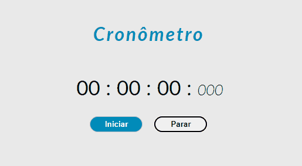
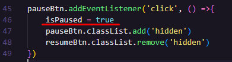

# Cronômetro
Este projeto consiste em criar um cronômetro e todas as suas funcionalidades.

### Tecnologias
- HTML
- CSS
- Javascript

### Demonstração em vídeo curto

``Acelerei o cronômetro para demonstrar melhor o projeto.``

### Detalhes

- Criei uma animação no elemento dos minutos e com o JS, é inserido a cada vez que o minuto é icrementado.

- No escopo global, foi criada a variável do tipo boleano, isPaused e recebe o valor false. Na função principal, esta variável foi escrita dentro da condicional if: caso a variável isPaused seja falsa, tendo dentro do bloco de execução, a variável intervalId, que recebe o método *setInterval*(repetindo um bloco de código a cada 10ms), para fazer a contagem do tempo.

- Para pausar o cronômetro, foi criado um evento de click que tem como função principal, alterar o valor do isPaused para ``true`` (fazendo essa alteração, o cronômetro já é interrompido):

- A variável intervalId foi criada, para que na função ``stopTimer``, eu possa interromper o *setInterval* com o método *clearInterval*, passando o intervalId como parâmetro. Fazendo isso, eu "zero" a contagem do cronômetro. Obs: Escrevi o código de uma forma que eu consiga zerar o cronômetro, apenas quando o mesmo estiver em pause.